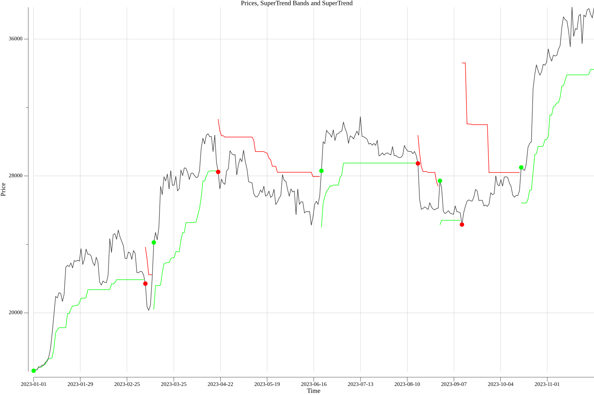

## Goblin Trader: The GoLang Trading Bot
Opensource Trading Bot based on Go.

The goal of this project is to have automation that trades during our work days in a reliable and stress free way. Stress free you may ask , well yes (at least as stress free as possible). With the combination of the SuperTrend and using longer time windows of an Asset we are able to get reliable Buy and Sell signals. 

This project also supports short term traders, so no worries for the degens out there. 


So far you can create charts based on Cryptocurrency key pairs e.g. `BTC/USD`, `ETH/USD`. Check out other supported [key pairs](https://api.twelvedata.com/cryptocurrencies).


### Roadmap
 - Gather Datapoints from TwelveData API ✅
 - Transform TwelveData datapoints into DataFrame ✅
 - Code SuperTrend Formula to use against DataFrame ✅
 - Display SuperTrend and Asset price on a graph using Plotty and render it as a PNG ✅
 - Represent a SuperTrend against an Asset via CSV ✅
 - Create Backtesting
 - Create Trading Strategy
 - Add support for exhanges (Bianance, Coinbase and others)
 - Have the bot trade for me!

 ### Usage so far
 Set your [TwelveData](https://twelvedata.com/) token as an environment variable
 ```
 export TWELVE_TOKEN=<KEY>
 ```
 create a chart with the SuperTrend superimposed

 ```
 # will render a chart of BTC/USD with a 1 day time window since Jan 2023
 
go run main.go chart -a BTC/USD  -t 1day  -s 2023-01-01
 ```

 will result in a a chart like this:


use `go run main.go --help` for more information

### Why the SuperTrend? 
The SuperTrend isn't the only indicator this project will end up using to form trading strategies but it is the first and it does follow this projects goals of reliability.

 - It is easy to use and interpret. The Supertrend indicator is easy to use and interpret. It is represented by a single line that changes color based on the direction of the trend.

 - It is effective in both trending and ranging markets. It can also be used to identify potential breakouts and breakdowns in ranging markets.
 
 - It can be used to generate both entry and exit signals. The Supertrend indicator can be used to generate buy signals when the price crosses above the line, and sell signals when the price crosses below the line.

Of course, no technical indicator is perfect, and the Supertrend indicator is no exception. It can sometimes produce false signals, especially in choppy or sideways markets. However, it is still a valuable tool and more often than not the SuperTrend prevails!


### Development
go version >= 1.17 

To install modules run
`go get`

